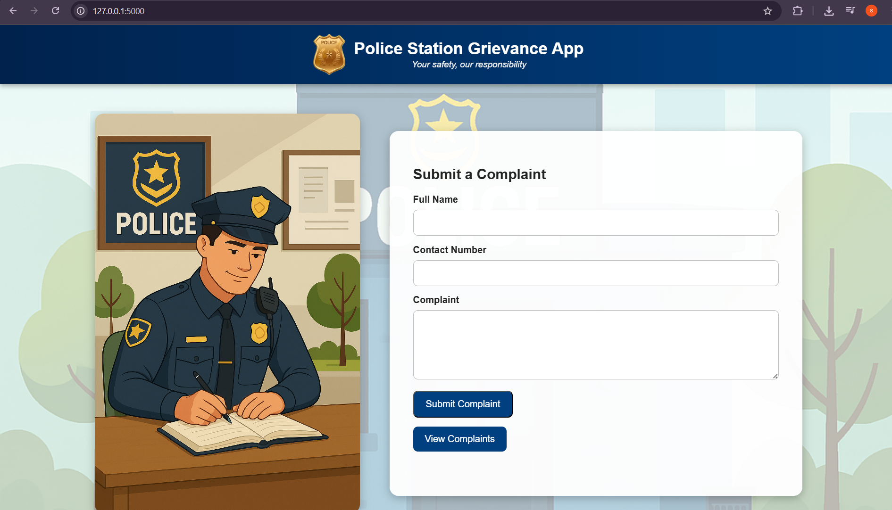
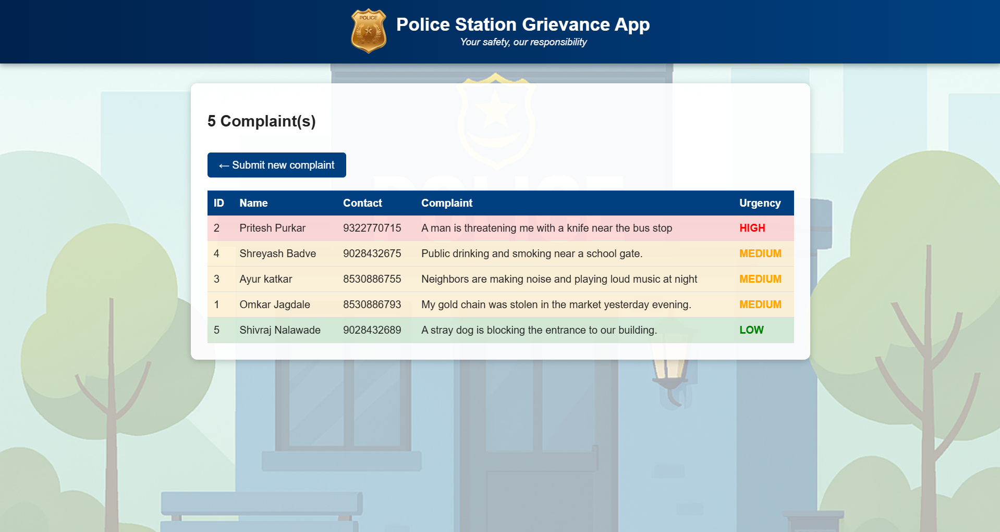

# 🚨 Police Station Grievance App  

A web-based complaint management system built using **Flask** and **SQLite**, designed to help citizens easily log their complaints at the police station.  
The system automatically classifies complaints into **High**, **Medium**, or **Low** urgency levels using keyword-based natural language processing and displays them in a **sorted, color-coded list** for quick review.  

---

## 👨‍💻 Project Contributors  

- **Shivraj Nalawade** (PRN: 202301060008)  
- **Atharva Rajandekar** (PRN: 202301060027)  

---

## 📖 Problem Statement  

Create a **mobile or web application** that enables citizens to:  
- Log complaints easily through a user-friendly interface.  
- Automatically classify the complaints into **urgency levels** (High / Medium / Low) using keyword detection.  
- Display the complaints in a **sorted, color-coded list** for efficient police response.  

---

## ✨ Features  

✅ Complaint submission form with user details (Name, Contact, Complaint).  
✅ Automatic **urgency classification** (High/Medium/Low) using regex-based keyword matching.  
✅ Re-classification of existing complaints whenever the keyword database is updated.  
✅ Color-coded complaint list:
   - 🔴 High → Red row highlight  
   - 🟠 Medium → Orange row highlight  
   - 🟢 Low → Green row highlight  
✅ Simple, modern, and responsive **homepage layout** with officer image & complaint form.  
✅ Secure storage of complaints using **SQLite database**.  

---

## 🛠️ Tech Stack  

- **Backend:** Python, Flask  
- **Frontend:** HTML5, CSS3,  
- **Database:** SQLite  
- **Version Control:** Git & GitHub  

---

## 📸 Screenshots  

### 🏡 Homepage  
  

### 📝 Complaints Page  
  

---

